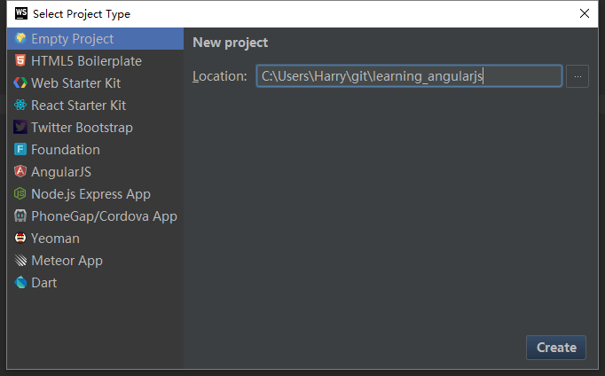
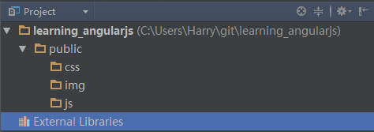
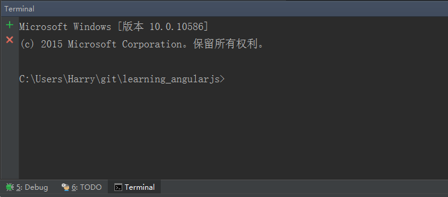
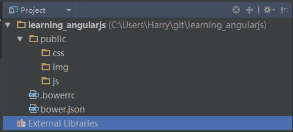

# 项目的创建和配置
使用WebStorm可以直接创建AngularJS项目，且会自动帮助你配置好项目并自动下载AngularJS等库。但是我们这里将创建一个新的空项目（Empty Project），然后一步一步的将各个需要的内容填充进来，这样我们会对使用AngularJS开发有一个更好的了解。

在WebStorm中，选择`File > New Project`，然后选择Empty Project，在右边的Location设置好项目的位置，然后点击界面右下角的Create即可。



下面我们将一步一步的完善整个项目的结构。

## 创建基本的文件结构
首先建立一个`public`目录，并在`public`目录中建立`js`、`css`、`img`三个目录。如下图所示：



大家对于`js/css/img`三个目录的设置应该比较熟悉，他们分别用于存放对应的文件，`img`用于存放图片文件。

但是，为什么要把他们放置到`public`目录中呢？

### `public`目录设置的意义
从字面意思即可理解，`public`目录是用来存放供外部用户访问的内容的根目录。非`public`目录下的内容，既是我们不期望用户通过网络链接直接可以访问到的内容。会有哪些内容呢？
- 产品的文档
- 一些项目配置文件（如`bower`的配置文件）
- 测试文档

这些文件我们是绝对不希望用户可以直接访问到的，通过设置一个public目录，并在部署时将网站的根目录直接指向到`public`目录，即可保证目录外的内容不被暴露到网络当中。

另外，这样设置的主要原因是为了使用git将整个项目都管理起来。通过git版本控制的方式来保证项目代码的完整性和安全性。具体的git的操作方法就不在本文中叙述了。

## 配置并初始化bower
bower的配置可以通过手动创建文件或者命令行的方法来进行。我推荐使用命令行的方式来进行创建，这样可以更好的理解配置生成的文件的内容。如果不想通过命令行创建，也可以跳过下面命令行创建的部分，直接在下方生成的文件解析的部分，将文档内容拷贝过去。

### 打开命令行工具
WebStorm内置了命令行工具（调用系统的命令行功能），在左下角点击`Terminal`即可启用。



### 初始化bower
在命令行下运行`bower init`，你将会看到如下的若干选项，并会自动的在项目的根目录生成一个`bower.json`。

**注：以下的汉字部分都是额外加入的注释。**

```bash
//运行命令
>bower init

//第一次运行的时候会弹出，是否愿意提交匿名的统计信息。随意选择
? May bower anonymously report usage statistics to improve the tool over time? Yes
//项目名称
? name learning_angularjs
//项目说明
? description
//主文件
? main file
//项目的类型
? what types of modules does this package expose?
//项目的关键字
? keywords
//作者和联系方式
? authors Harry <harry@andtoo.net>
//授权方式，如果您期望这是一个私人项目，可以输入No License
? license MIT
//项目主页
? homepage
//是否要把当前已经安装的模块设置为项目的依赖项？
? set currently installed components as dependencies? Yes
//将常用的忽略文件项添加到列表？
? add commonly ignored files to ignore list? Yes
//将项目设置为私有，防止其被误发布到网络上？
? would you like to mark this package as private which prevents it from being accidentally published to the registry? Yes

//以下是生成的配置文件的预览
{
  name: 'learning_angularjs',
  authors: [
    'Harry <harry@andtoo.net>'
  ],
  description: '',
  main: '',
  moduleType: [
  ],
  license: 'MIT',
  homepage: '',
  private: true,
  ignore: [
    '**/.*',
    'node_modules',
    'bower_components',
    'test',
    'tests'
  ]
}

? Looks good? Yes
```

命令运行完毕后，会在项目的根目录生成一个`bower.json`文件，里面的内容如下：

```json
//bower.json
{
  "name": "learning_angularjs",
  "authors": [
    "Harry <harry@andtoo.net>"
  ],
  "description": "",
  "main": "",
  "moduleType": [
  ],
  "license": "MIT",
  "homepage": "",
  "private": true,
  "ignore": [
    "**/.*",
    "node_modules",
    "bower_components",
    "test",
    "tests"
  ]
}
```

如果您不希望bower配置文件这么复杂，那么可以手工最简化的创建`bower.json`。

```json
//最简化bower.json
{
  "name": "learning_angularjs"
}
```

只需要一个`name`字段即可让bower好好工作了。

## `.bowerrc`配置文件
由于我们建立了`public`目录，并且项目的根目录与网站根目录不同，因此，我们需要新建一个额外的`.bowerrc`文件，告诉`bower`将组件库下载到特定的目录。

在项目根目录创建`.bowerrc`文件，并在其中加入如下内容：

```json
//.bowerrc
{
  "directory": "public/components"
}
```

以上配置文件会告诉`bower`将文档下载到`./public/components`目录中。

### 配置完成
至此，我们对`bower`的配置已经全部结束！现在项目看起来应该长这个样子：


