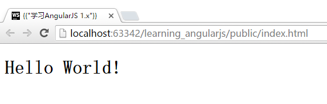

# AngularJS初始化`ng-app`
本节我们将学习基本的`ng-app`初始化。

`ng-app`可以将网页自动初始化为一个AngularJS应用，这样你才能在网页中使用各种AngularJS提供的功能（比如前一节介绍的基本表达式功能）。

在现在阶段，我们并不会用到`ng-app`的扩展功能，只需要在独立的JavaScript文件中将`ng-app`声明好，再引用入HTML页面即可。

## 创建一个独立的JavaScript文件，并在HTML中引用
在`./public/js`目录中新建一个`app.js`文件，并填入如下代码：

```javascript
var App = angular.module("App", []);
```

在`index.html`中引入`app.js`文件，并将`ng-app`配置进去即可。

```html
<!DOCTYPE html>
<html lang="zh" ng-app="App">
<head>
    <meta charset="UTF-8">
    <title>学习AngularJS 1.x</title>
</head>
<body>
    <h1>{{"Hello World!"}}</h1>
    <script type="text/javascript" src="components/angular/angular.js"></script>
    <script type="text/javascript" src="js/app.js"></script>
    <!-- 这里我们将app.js引入了进来 -->
</body>
</html>
```

以上代码有两个问题需要注意：

### AngularJS的作用域
`ng-app`标签可以放置在`<html>`标签或者`<body>`标签上，也可以放置在HTML页面的任何一个标签上。

这里，我们就需要注意AngularJS对于**作用域**的定义。我们先通过如下的例子来看看作用域的具体表现：

```html
<!DOCTYPE html>
<html lang="zh">
<head>
    <meta charset="UTF-8">
    <!-- 网页的标题，我们在这里使用了AngularJS的基本表达式 -->
    <title>{{"学习AngularJS 1.x"}}</title>
</head>
<body ng-app="App"> <!-- ng-app被放置在了这里 -->
    <h1>{{"Hello World!"}}</h1>
    <script type="text/javascript" src="components/angular/angular.js"></script>
    <script type="text/javascript" src="js/app.js"></script>
</body>
</html>
```

以上代码的运行结果如下：



我们可以看到，网页标题中的AngularJS表达式并没有执行，这是因为网页的`<head>`标签中的内容，并不在AngularJS的管理之下。

如果我们将`ng-app`声明放置在`<body>`元素中，那么AngularJS**只会**针对`<body>`元素中的内容进行处理。**这也是AngularJS的核心特性之一**，它让我们的JavaScript代码有了作用域的概念，降低了代码之间不期望的一些互相影响。

这个特性我们在后面会大量的使用，将网页分为多个部分，并分别交于不同的JavaScript代码进行管理，各个部分之间互相独立，这样即可在网页中实现逻辑复杂的功能。

## 引入文件的顺序
引入JavaScript文件的顺序是有差异的，如果我们将上面代码的`angular.js`和`app.js`文件呼唤，那么网页将不能正常的展示。并且我们可在Chrome的"开发者工具"中看到报错信息。
