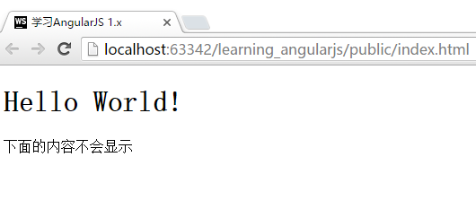

# 控制器`ng-controller`
控制器`ng-controller`是使用AngularJS的核心功能之一。在前一节我们已经了解了作用域的概念，`ng-controller`则是真正应用作用域来制作功能的核心部分。

应用`ng-controller`和应用`ng-app`类似，下面我们来尝试创建一个控制器吧！

还是在app.js中，我们创建一个控制器，代码如下：

```javascript
//app.js
var App = angular.module("App", []);

App.controller("FirstCtrl", function($scope){
    $scope.data = {
      message : "Hello"
    };
});
```

同时，我们在`index.html`中进行一些代码修改，最终代码如下：

```html
<!DOCTYPE html>
<html lang="zh" ng-app="App">
<head>
    <meta charset="UTF-8">
    <!-- 网页的标题，我们在这里使用了AngularJS的基本表达式 -->
    <title>{{"学习AngularJS 1.x"}}</title>
</head>
<body>
    <!-- 将FirstCtrl绑定到这个div标签上，这个标签中的内容将可以使用FirstCtrl中的数据-->
    <div ng-controller="FirstCtrl">
        <h1>{{data.message + " World!"}}</h1>
    </div>

    <!-- 以下表达式不会输出任何内容，因为它在FirstCtrl之外-->
    <p>下面的内容不会显示</p>
    <p>{{data.message}}</p>

    <script type="text/javascript" src="components/angular/angular.js"></script>
    <script type="text/javascript" src="js/app.js"></script>
</body>
</html>
```

刷新页面，我们可以看到运行的效果:



下面，我们再来分析下`ng-controller`的具体形式：

## `ng-controller`详解
### JavaScript部分
我们先分析`ng-controller`的JavaScript编码部分

```javascript
//原有的ng-app声明部分
var App = angular.module("App", []);

/**
 * App.controller 声明ng-controller的方法
 * “FirstCtrl” 这个ng-controller的名称
 * function($scope){} 这个ng-controller的实体，并注入$scope（下文详解）
 */
App.controller("FirstCtrl", function($scope){
    $scope.data = {
      message : "Hello"
    };
});
```

#### `function($scope){}`详解
`funtion(){}`封装的函数，会被绑定到`FirstCtrl`上。这个概念相对容易理解，我们需要注意的，是我们在`function`中传入的**参数**`$scope`。

与一般的函数声明时的参数不同，此处的参数是**不可随意命名**的，AngularJS会解析参数的名称，并转化为对应的对象传入。

这里使用的`$scope`，用于将`ng-controller`中的数据和HTML代码绑定起来，传入`$scope`的数据，可以直接在HTML代码中调用。在上面的例子中，我们对`$scope`传入了`{data:{message:"Hello"}}`对象，并在HTML代码中直接使用了`data.message`来调用。

`data`命名并不是固定用法，我们也可以使用`$scope.shuju = {m:"hello"}`。（这里只是为了表明变量命名的约束，如果可能，请不要使用拼音命名的变量）。

值得注意的是，`$scope`之下除了可以传入数据外，还可以传入其他函数，比如我们声明一个`onClick`函数传入`$scope`之后，可在HTML页面中调用这个功能，实现比如按钮点击触发功能的效果。

### HTML中调用`ng-controller`中的数据

```javascript
<h1>{{data.message + " World!"}}</h1>
```

在`$scope`中传入数据后，通过表达式可以直接调用。

### 为什么要额外封装一层
在AngularJS中，最简单传入数据的方法其实可以更简单，但是**不推荐这样做**。

最简单的做法

```javascript
//JavaScript
$scope.message = "Hello";
```

```html
//HTML
<div ng-controller="FirstCtrl">
  {{message}}
</div>
```

为什么不推荐这样做呢？因为在我们后续会学习应用`filter`或`directive`等功能时，或者将数据在多个`ng-controller`之间共享时，如果不对数据进行二次封装，可能会导致数据互相访问不了的情况。在使用AngularJS的时候，养成数据二次封装的习惯，可以避免很多这样的问题。
