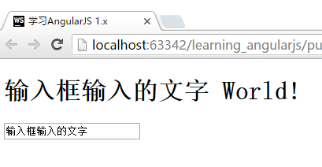
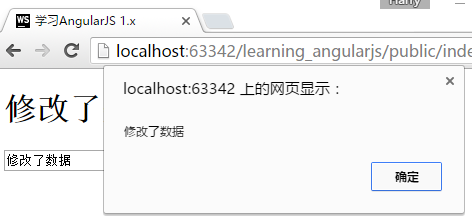
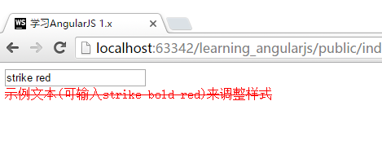

# 数据绑定data-binding
上一节我们介绍了如何将`ng-controller`的数据显示在HTML当中，但是我们如何在页面中修改这些数据呢？这一步操作也很简单。

我们先直接看看代码吧！

```html
<!DOCTYPE html>
<html lang="zh" ng-app="App">
<head>
    <meta charset="UTF-8">
    <!-- 网页的标题，我们在这里使用了AngularJS的基本表达式 -->
    <title>{{"学习AngularJS 1.x"}}</title>
</head>
<body>
    <!-- 将FirstCtrl绑定到这个div标签上，这个标签中的内容将可以使用FirstCtrl中的数据-->
    <div ng-controller="FirstCtrl">
        <h1>{{data.message + " World!"}}</h1>
        <!-- 这里增加了一个input输入框，并使用ng-model绑定了data.message-->
        <input type="text" ng-model="data.message">
    </div>

    <script type="text/javascript" src="components/angular/angular.js"></script>
    <script type="text/javascript" src="js/app.js"></script>
</body>
</html>
```

运行结果



如果您实际运行代码，会发现，您每输入/删除一个文字，改动会马上在上方显示出来。这就是数据绑定的魅力！

## 功能的绑定
界面操作里面还有一个重要的功能，就是界面上按钮的与控制器中的函数进行绑定。这个也很容易实现：

```javascript
App.controller("FirstCtrl", function($scope){
    $scope.data = {
      message : "Hello"
    };

    //在$scope上绑定一个函数
    $scope.onClick = function(){
        alert($scope.data.message);
    }
});
```

```html
<div ng-controller="FirstCtrl">
    <h1>{{data.message + " World!"}}</h1>
    <input type="text" ng-model="data.message">
    <!-- 这里我们放置一个按钮，并使用ng-click绑定了$scope.onClick事件-->
    <input type="button" value="按钮" ng-click="onClick()">
</div>
```

点击按钮，我们即可看到数据通过弹出框显示了出来（`onClick`函数中的逻辑）。



## 更多地方的绑定
除了用于显示信息外，数据绑定还可用于其他地方。比如，下面的例子用于根据输入来调整样式：

```html
<!DOCTYPE html>
<html lang="zh" ng-app="App">
<head>
    <meta charset="UTF-8">
    <title>{{"学习AngularJS 1.x"}}</title>
    <style type="text/css">
        /* 删除线 */
        .strike {
            text-decoration: line-through;
        }

        /* 粗体 */
        .bold {
            font-weight: bold;
        }

        /* 红色 */
        .red {
            color: red;
        }
    </style>
</head>
<body>

<input type="text" ng-model="data.style">
<div class="{{data.style}}">示例文本(可输入strike bold red)来调整样式</div>

<script type="text/javascript" src="components/angular/angular.js"></script>
<script type="text/javascript" src="js/app.js"></script>
</body>
</html>
```

运行效果如下：


