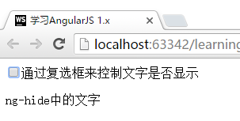

# 条件判断 `ng-if` / `ng-show` / `ng-hide`
本节我们将学习的是如何通过变量来控制HTML是否显示。

这三个语句具体的用法如下：

在`$scope.data`中添加`flag`变量，设置默认值为`true`

```javascript
//app.js
$scope.data = {
    message: "Hello",
    flag: true
};
```

将以下代码放置在FirstCtrl中

```html
<input type="checkbox" ng-model="data.flag">通过复选框来控制文字是否显示

<!-- 如果data.flag == true,则显示此段文字-->
<div ng-if="data.flag">
    <p>ng-if中的文字</p>
</div>

<!-- 如果data.flag == true,则显示此段文字-->
<div ng-show="data.flag">
    <p>ng-show中的文字</p>
</div>

<!-- 如果data.flag == false,则显示此段文字-->
<div ng-hide="data.flag">
    <p>ng-hide中的文字</p>
</div>
```

运行结果




从上面的例子可以看出，如果复选框打勾，则界面只显示了前两行文字；而取消复选框的打勾，则显示了最后的一行文字。这个特性可以用于展示界面上的某些信息或者按钮。

## `ng-if`与`ng-show`/`ng-hide`的区别
虽然效果看起来类似，但`ng-if`的工作模式与`ng-show`/`ng-hide`不一样。

如果使用`ng-if`来控制元素是否显示，则在不显示的情况下，`ng-if`中包含的内容，会被全部从HTML中移除掉。

而如果使用`ng-show`/`ng-hide`，AngularJS只是使用CSS控制将内容隐藏起来。

这两者可以应用于不同的场景，如果内容较多，且之后不会使用到，那么可以使用`ng-if`；如果之后还可能会显示出来，那么可以使用`ng-show`/`ng-hide`。

## 冒号中的表达式
例子中使用了`data.flag`直接作为判断依据，但是以上三个标签都支持传入表达式。

比如以下的表达式都可以作为冒号中的表达方式：

```javascript
data.flag >= 1
data.flag == true
```

但是请**注意**，在`ng-model`,`ng-if`等标签中传入参数时，是不需要双括号`{{`与`}}`将参数包裹起来的。
