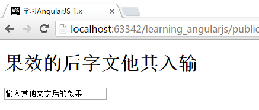
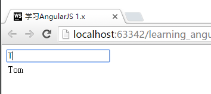

# 过滤器 `filter`
过滤器是AngularJS的另一项强大的功能，如果能使用好它，能够帮助我们极大的节省工作量。

以下是几个应用`filter`的例子：

```javascript
{{ 1234 | number:2 }}
//显示两位小数，结果 1,234.00

{{ 1234.56 | currency:"人民币￥":0}}
//转化为货币后输出(保留0位小数，四舍五入)，结果为
//人民币￥1,234.00

{{ list | json }}
//将对象转化为json文本输出，结果为
//[ { "name": "Harry" }, { "name": "Tom" }, { "name": "Jerry" } ]

<tr ng-repeat="x in list | orderBy:'name'">
//对显示的数据列表按照name进行排序
//结果为显示顺序Harry,Jerry,Tom
```

以上都是AngularJS的常用用法，具体的系统自带的`filter`的列表，我们可以从[官方网站](https://docs.angularjs.org/api/ng/filter)上获取。这里对管网提供的功能进行一个简要列表：

Filter名称  | 示例用法                           | 说明
:-------: | :----------------------------: | -----------------------------------------------
filter    | -                              | 传入自定义的函数作为过滤器
currency  | currency / currency:"人民币￥":0   | 转化为货币后输出。可选货币单位和保留小数位数。
number    | number / number:2              | 将数字转化为文本，自动加逗号。可选设置小数位数。
date      | data : format : timezone       | 将时间转化到对应的格式和时区
json      | json                           | 将对象转化为Json格式内容输出
lowercase | lowercase                      | 将文本转化为小写
uppercase | uppercase                      | 将文本转化为大写
limitTo   | limitTo : limit : begin        | 截取array从begin位置开始的limit个元素
orderBy   | orderBy : expression : reverse | 根据expression的条件对list进行排序，reverse可选，设置为true则反过来排

## 多个filter同时应用
AngularJS支持多个filter同时应用，比如以下的例子：

```javascript
{{ list | orderBy:'name' | json }}
//对list的内容进行排序后输出成json文本，结果为
//[ { "name": "Harry" }, { "name": "Jerry" }, { "name": "Tom" } ]
```

## 创建自己的过滤器
自己创建自定义的过滤器也很简单，我们下面尝试自己制作一个将文字全部翻转过来的过滤器。

在`app.js`中增加如下代码：

```javascript
//app.js
App.filter("reverse", function(){
    return function(text){
        return text.split("").reverse().join("");
    }
});
```

同时，我们利用最早的Hello World的例子，将我们定义的`reverse`这个过滤器应用上去，代码如下：

```html
<div ng-controller="FirstCtrl">
    <h1>{{data.message | reverse}}</h1>
    <input type="text" ng-model="data.message">
</div>
```

运行效果：



如果您期望界面显示的内容进行一些通用的处理，但是又不希望对原本的数据进行改动，那么可以考虑自己制作过滤器！

## 通过`filter`进行搜索
AngularJS提供了通过filter的搜索功能。当然，这个搜索功能并不是非常常用，因为搜索工作现在一般在服务端完成。如果数据量非常小（几百行以内），可以考虑使用本功能来筛选结果。

示例如下(使用上一节的例子)：

```javascript
App.controller("FirstCtrl", function ($scope) {
    $scope.searchText = '';

    $scope.list = [
        {
            name: "Harry"
        },
        {
            name: "Tom"
        },
        {
            name: "Jerry"
        }
    ];
});
```

```html
<div ng-controller="FirstCtrl">
    <input type="text" ng-model="searchText">
    <table>
        <tr ng-repeat="x in list | filter:searchText">
            <td>{{x.name}}</td>
        </tr>
    </table>
</div>
```

如果我们在输入框中输入T，则列表中只会显示包含T的项目。



### 一些值得注意的用法

用法                                  | 效果
----------------------------------- | --------------------------------
`searchText = "T"`                  | 搜索所有字段
`searchText = {name:"T"}`           | 只搜索`name`字段包含`T`的项目
`searchText = {name:"T", last:"H"}` | 搜索`name`字段包含`T`且`last`字段包含`H`的项目

对于最后一项，我们可以采取如下输入方法来应用：

```html
<div ng-controller="FirstCtrl">
    <input type="text" ng-model="searchText.name">
    <input type="text" ng-model="searchText.last">
    <table>
        <tr ng-repeat="x in list | filter:searchText">
            <td>{{x.name}}</td>
            <td>{{x.last}}</td>
        </tr>
    </table>
</div>
```
