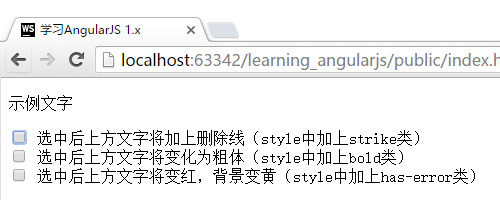
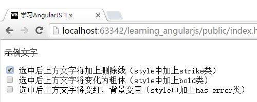
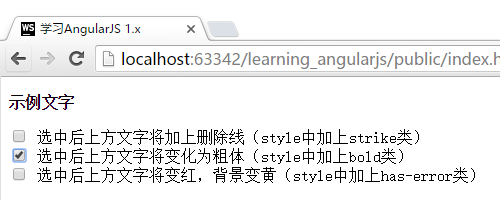
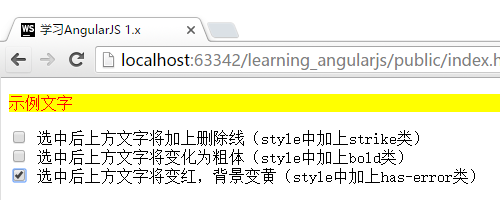
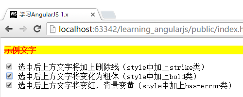
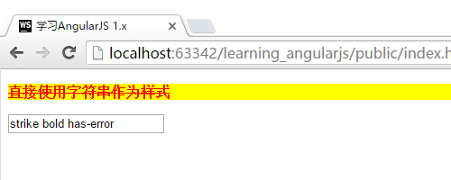

# 样式选择器 ng-class

通过ng-class，我们可以对界面元素的css样式进行控制。下面，让我们通过示例来看看功能如何实现：

>此示例来源于官网的[ngClass介绍界面](),我进行了一些加工。

首先，我们先创建一个style.css文件。
```css
/* 删除线 */
.strike {
    text-decoration: line-through;
}

/* 粗体 */
.bold {
    font-weight: bold;
}

/* 红色 */
.red {
    color: red;
}

/* 错误 */
.has-error {
    color: red;
    background-color: yellow;
}

/* 橙色 */
.orange {
    color: orange;
}
```

修改FirstCtrl为如下代码：
```javascript
//app.js
App.controller("FirstCtrl", function ($scope) {
    $scope.data = {
        deleted:false,
        important:false,
        error:false
    };
});
```

并在*index.html*的head部分将css文件引入，并加入对应的代码。全部代码如下：
```html
<!DOCTYPE html>
<html lang="zh" ng-app="App">
<head>
    <meta charset="UTF-8">
    <title>{{"学习AngularJS 1.x"}}</title>

    <!-- 此处引入style.css样式文件-->
    <link type="text/css" rel="stylesheet" href="css/style.css">

</head>
<body>
<div ng-controller="FirstCtrl">

    <!-- 此处放置了ng-class，并设定了每个样式激活时的条件（对应下方3个复选框）-->
    <p ng-class="{strike: deleted, bold: important, 'has-error': error}">示例文字</p>
    <input type="checkbox" ng-model="deleted">
        选中后上方文字将加上删除线（style中加上strike类） <br>
    <input type="checkbox" ng-model="important">
        选中后上方文字将变化为粗体（style中加上bold类） <br>
    <input type="checkbox" ng-model="error">
        选中后上方文字将变红，背景变黄（style中加上has-error类）
</div>

<script type="text/javascript" src="components/angular/angular.js"></script>
<script type="text/javascript" src="js/app.js"></script>
</body>
</html>
```

运行效果：

未选中时效果



选中第一个的效果



选中第二个的效果



选中第三个的效果



全部选中的效果



## 动态化的样式输入

在上方的示例中，我们是针对提前设定好的样式进行是否生效的判断。除了这种使用方式，ng-class还支持直接传入字符串的方式进行样式调整。

比如如下示例：

```javascript
App.controller("FirstCtrl", function ($scope) {
    $scope.data = {
        style: ""
    };
});
```

```html
<div ng-controller="FirstCtrl">
    <p ng-class="data.style">直接使用字符串作为样式</p>
    <input type="text" ng-model="data.style">
</div>
```

运行效果



## 结合两种模式的应用示例

这两种模式也可以结合使用，示例如下：

```html
<p ng-class="[data.style, {orange: warning}]">同时应用两种样式</p>
```

此示例可举一反三，比如加入多个文本输入（对应多个来源），以及多个设定好的样式开关。

>此示例就不进行具体的运行效果展示了，请读者自行测试效果。

## CSS动画效果应用

我们先在*style.css*中加入css的动画效果代码：
```css
.base-class {
    transition:all cubic-bezier(0.250, 0.460, 0.450, 0.940) 0.5s;
}

.base-class.animate {
    color: red;
    font-size:3em;
}
```

修改HTML代码如下：
```html
<div ng-controller="FirstCtrl">
    <input type="button" value="开始动画" ng-click="style='animate'">
    <br>
    <input type="button" value="恢复原始" ng-click="style=''">
    <br>
    <span class="base-class" ng-class="style">示例文本</span>
</div>
```

运行之后，点击上面的按钮，则文字放大变红。点击第二个按钮，则文本变回原来的样子。

由于动画效果无法通过截图表示，还请读者自行测试。
