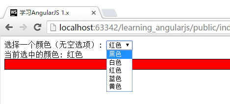
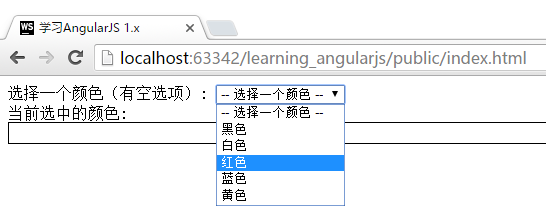
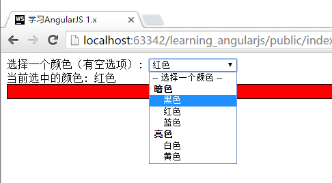
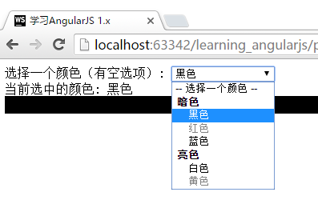
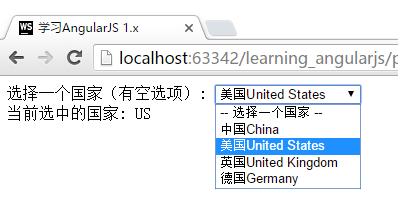

# 下拉列表选项 `ng-options`
在学习了`ng-repeat`过后，我们其实已经可以用循环的方式实现下拉列表的选项。但是，AngularJS提供了`ng-options`的方法，让我们能够更轻松的完成这项工作。

官网提供了一个详尽的[示例](https://docs.angularjs.org/api/ng/directive/ngOptions)进行演示(点击打开后滑动到页面最下部进行效果测试)，本节中的内容，是将官网的内容进行梳理后进行的讲解。

`ng-options`提供了很多功能用来梳理或筛选下拉列表的选项。我们将分别学习它们。

首先，让我们学习下如何使用`ng-options`。这里，我们期望实现的是，使用下拉列表，让页面上的一个方块的颜色对应变化：

我们首先配置一个颜色的列表，并且在`$scope`中存储一个用于保存选中状态的变量，将它的默认值设置为颜色列表的第一个：

```javascript
App.controller("FirstCtrl", function ($scope) {
    $scope.colors = [
        {name: '黑色', color:'black' },
        {name: '白色', color:'white' },
        {name: '红色', color:'red' },
        {name: '蓝色', color:'blue' },
        {name: '黄色', color:'yellow'}
    ];

    //保存选中的状态，默认颜色设置为黑色
    $scope.colorChosen = $scope.colors[0];

});
```

```html
<div ng-controller="FirstCtrl">

    <label>选择一个颜色（无空选项）:
        <select ng-model="colorChosen" ng-options="color.name for color in colors">

        </select>
    </label>
    <br>

    当前选中的颜色: {{ colorChosen.name }}
    <div style="border:solid 1px black; height:20px"
         ng-style="{'background-color':colorChosen.color}">
    </div>
</div>
```

运行页面，我们可以看到下拉列表中有列表中的五种颜色，并且选中不同颜色后，下方方框内的颜色，会根据选择变化。

 

颜色根据选中状态变化，利用到了`ng-model`和`ng-style`的特性。下面，我们将仔细讲解`ng-options`中的语法：
- `color.name`
  - 用于显示在下拉框中的名称

- `for color in colors`
  - 类似于ng-repeat中的用法，将colors遍历，每次遍历的对象命名为color

## 增加未选中的选项
在很多时候，我们期望能有一个没选中的选项。我们可以通过手动的方式添加这个选项：

```html
<select ng-model="colorChosen" ng-options="color.name for color in colors">
    <option value="">-- 选择一个颜色 --</option>
</select>
```



## 按组排列`group by`
`ng-options`也支持按组排列数据，使用`group by`语法，下面我们看看例子：

首先，我们在列表中增加类型字段：

```javascript
$scope.colors = [
    {name: '黑色', color: 'black', type: "暗色"},
    {name: '白色', color: 'white', type: "亮色"},
    {name: '红色', color: 'red', type: "暗色"},
    {name: '蓝色', color: 'blue', type: "暗色"},
    {name: '黄色', color: 'yellow', type: "亮色"}
];
```

然后修改ng-options的语法：

```html
<select ng-model="colorChosen" ng-options="color.name group by color.type for color in colors">
```

运行效果：



## 禁用某些选项`disable when`
`ng-options`还可以通过`disable when`语法来设置选项是否可选，同样的，我们需要在列表中先新增字段：

**注意**，以下第一列数据并未加上`disabled`属性，这是为了表明如果没有这项数据，默认的`ng-options`的操作（可以选择）。

```javascript
$scope.colors = [
    {name: '黑色', color: 'black', type: "暗色"},
    {name: '白色', color: 'white', type: "亮色", disabled: false},
    {name: '红色', color: 'red', type: "暗色", disabled: true},
    {name: '蓝色', color: 'blue', type: "暗色", disabled: false},
    {name: '黄色', color: 'yellow', type: "亮色", disabled: true}
];
```

然后修改`ng-options`的语法：

```html
<select ng-model="colorChosen"
        ng-options="color.name group by color.type
        disable when color.disabled for color in colors">
```

运行结果：

 可以看到，图中的"红色"和"黄色"变为了不可选择的状态。



## 将对象作为参数传入
在上面的例子中，我们传入的是一个列表`array`。`ng-options`也支持以对象`object`的方式传入数据：

使用`object`的方式传入数据，一般是为了简化配置，比如我们采取如下的配置：

```javascript
$scope.countries = {
    CN: '中国China',
    US: '美国United States',
    UK: '英国United Kingdom',
    GR: '德国Germany'
};

$scope.country = 'CN';
```

注意，以下代码中，for后面有一个**空格**。如果没有，则无法成功运行！这是因为传入`ng-options`的其实是一串文本，而AngularJS需要解析这段文本，因此提出了对格式的要求。

```html
<div ng-controller="FirstCtrl">

    <label>选择一个国家（有空选项）:
        <select ng-model="country" ng-options="k as v for (k, v) in countries">
            <option value="">-- 选择一个国家 --</option>
        </select>
    </label>
    <br>

    当前选中的国家: {{ country }}
</div>
```

运行结果，请注意列表中显示的值和选中时变量的值的关系。


