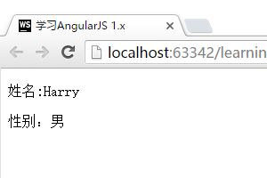
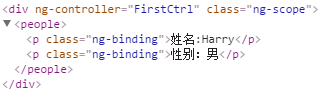

# 制作一个自定义的Directive
下面我们将制作我们的第一个自定义Directive。让我们对`app.js`和`index.html`进行一些修改：

```javascript
//app.js
var App = angular.module("App", []);

App.directive("people", function(){
    return {
        restrict: "E",
        template : "<p>姓名:{{data.name}}</p><p>性别：{{data.sex}}</p>"
    }
});

App.controller("FirstCtrl", function ($scope) {
    $scope.data = {
        name: "Harry",
        sex : "男"
    };
});
```

```html
<!DOCTYPE html>
<html lang="zh" ng-app="App">
<head>
    <meta charset="UTF-8">
    <title>{{"学习AngularJS 1.x"}}</title>
    <link type="text/css" rel="stylesheet" href="css/style.css">
</head>
<body>
<div ng-controller="FirstCtrl">
    <!-- 注意这里只加入了一个people的标签 -->
    <people></people>
</div>

<script type="text/javascript" src="components/angular/angular.js"></script>
<script type="text/javascript" src="js/app.js"></script>
</body>
</html>
```

运行结果：



## 代码分析
以下这段代码用于声明一个Directive：

```javascript
App.directive("people", function(){
    return {
        restrict : "E",
        template : "<p>姓名:{{data.name}}</p><p>性别：{{data.sex}}</p>"
    }
});
```

我们将这段代码分拆开逐步讲解:

首先，声明一个Directive的基本结构如下，我们调用了`directive()`函数来告诉AngularJS加入一个新的Directive：

```javascript
App.directive();
```

调用这个函数，我们需要传入2个参数，第一个参数是Directive的命名（这里是`people`)，第二个参数是这个Directive的功能。

```javascript
App.directive("people", function(){});
```

在实例中，我们直接在第二个参数的函数中返回了一个对象:

```javascript
return {
    restrict: "E",
    template : "<p>姓名:{{data.name}}</p><p>性别：{{data.sex}}</p>"
}
```

这个对象中有两个元素，`restrict`和`template`。

### `template`
`template`相对比较容易理解，在运行网页时，HTML对应的标签，将被替换成对应的内容。我们这里看看替换后实际的HTML代码如何：



可以看到，AngularJS在`<people></people>`中间加入了template中的内容。

#### 用替换而不是插入的方式应用Directive
如果在配置Directive时，加入`replace : true`（与`restrict`和`template`同级别），则可以让AngularJS用替换的模式应用Directive。

```javascript
App.directive("people", function(){
    return {
        restrict : "E",
        replace : true,
        template : "<p>姓名:{{data.name}}</p><p>性别：{{data.sex}}</p>"
    }
});
```

具体的效果，是会去除掉`<people> </people>`这对标签。

### `restrict`
`restrict`是告诉AngularJS，这个Directive应该如何使用。

下面这个表格，总结了restrict可能有的值，具体的每种应用方案，我们将在下一节详解。

值   | 对应类型      | 使用方法
--- | --------- | -----------------------------
E   | element   | `<people> </people>`
A   | attribute | `<div people> </div>`
C   | class     | `<div class="people"> </div>`
EAC | -         | 以上三种都可使用

如果在restrict中设定了使用方法，而在HTML代码中却未按照对应的方法使用，那么代码将不会生效！
