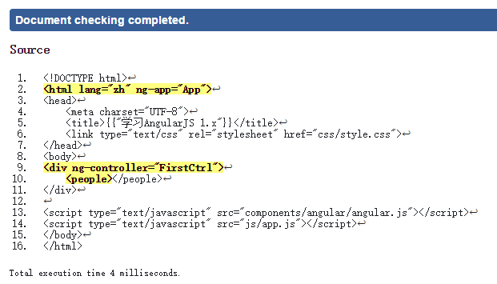
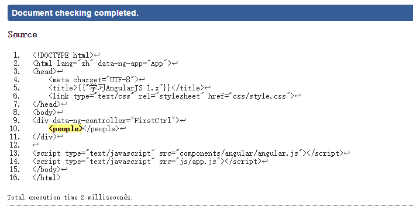

# Directive的命名和使用规则
在前一节中，我们创建了一个名为"people"的Directive。并且通过 `<people> </people>` 使用了它。

但是，在实际应用场景中，我们的命名通常不止1个单词，这时候我们就需要注意Directive的命名和使用规则。

对Directive的命名，AngularJS是有特殊的规则需求的。并且，在JavaScript中的命名，与在HTML对应使用时的名称**不一样**！

## 命名规则
AngularJS要求Directive的命名使用**驼峰式**语法，也就是从第二个单词开始，每个单词的首字母大写，并且不使用连接符号。

驼峰式命名的例子：
- `people`
- `peopleList`
- `peopleListArray`

## 使用规则
在HTML代码中，使用的是连接符的形式，下面我们对比看看命名和使用的对应字符串：

命名                | 使用
----------------- | -------------------
`people`          | `people`
`peopleList`      | `people-list`
`peopleListArray` | `people-list-array`

实际使用举例

```html
<people-list> </people-list>

<div people-list-array> </div>
```

## 为什么会有这种差异
命名和用法不同的核心原因，是**因为HTML对大小写不敏感，而JavaScript对大小写敏感**。

为了保证HTML和JavaScript都能按原有模式正常工作，AngularJS提出了这套解决方法。

## 怎么实现的？
AngularJS在解析HTML时，会将名称取出（如`people-list-array`)，并进行一下两个方面的处理：
1. 去除字段的 x- 或 data- 头。(`people-list-array`)
2. 将字段中的连接符号去除，并将第二个单词开始改为首字母大写，其他字母小写。(`[people,List,Array]`)
3. 然后合并起来。（`peopleListArray`)

### 连接符
在前面的讲解中，我们讲解示例时，使用的连接符全部都为减号。但实际上，AngularJS支持的连接符有:

符号       | 示例
-------- | -------------
减号( - )  | `people-list`
冒号( : )  | `people:list`
下划线( _ ) | `people_list`

但是实际使用中，推荐使用**减号**作为连接符。其他的两种符号，只是因为历史原因提供了支持，但是并不推荐使用。

### 为什么要先去除`data-/x-`部分
`data-/x-` 存在的原因是需要符合HTML5标准。如果你使用[HTML5验证器](https://validator.w3.org/nu/#textarea)来验证我们之前的代码，你可能会看到如下结果(黄色背景部分代表不符合标准)：



而如果我们在ng-app和ng-controller前加上data-前缀，则可以通过HTML5的验证。



所以，如果你的项目需要使用HTML5的验证工具，那么就需要在字段前加上data-前缀。

另：x-的存在，可能是针对XHTML的支持。

**注意：**，因为有这个条件存在，因此，请不要给你的Directive起data开头的名字！
