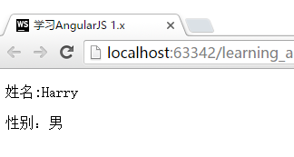
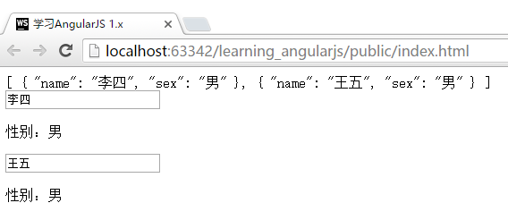
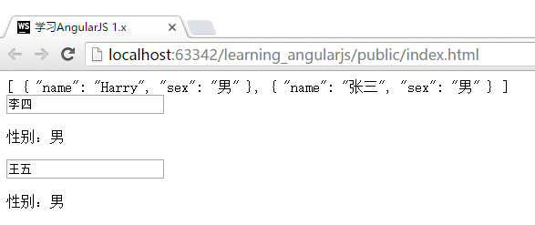

# 让Directive支持传入数据
在第一节中，我们使用的Directive，可以直接获取并显示控制器中的数据（人的名称和性别）。但是，如果我们有多个人的信息需要显示怎么处理？这个问题其实非常常见，因为Directive通常是将需要在界面中重复使用的部分抽象出来，便于一次修改，多处地方生效（如博客的评论的列表显示）。

如果我们按照现在的代码结构（详见第一节），期望放置不同的人的信息，只能采取重复多个控制器的方式，可能的代码如下：

```html
<!DOCTYPE html>
<html lang="zh" ng-app="App">
<head>
    <meta charset="UTF-8">
    <title>{{"学习AngularJS 1.x"}}</title>
    <link type="text/css" rel="stylesheet" href="css/style.css">
</head>
<body>
<div ng-controller="FirstCtrl">
    <!-- 第一个人的信息 -->
    <people></people>
</div>

<div ng-controller="SecondCtrl">
    <!-- 第二个人的信息 -->
    <people></people>
</div>


<script type="text/javascript" src="components/angular/angular.js"></script>
<script type="text/javascript" src="js/app.js"></script>
</body>
</html>
```

这样做，无法实现动态化的列表，是无法实现我们期望的功能的。我们理想中的情况应该是什么样子呢？当然是能够并列放置这些Directive，通过传入不同的数据来让Directive展示不同的内容。

```html
<div ng-controller="FirstCtrl">
    <!-- 第一个人的信息 -->
    <div people='peopleOneInfo'></div>

    <!-- 第二个人的信息 -->
    <div people='peopleTwoInfo'></div>
</div>
```

这样的功能，可以通过配置Directive的`scope`定义实现。

## Directive的`scope`
在之前学习控制器`ng-controller`的使用过程中，我们使用了`$scope`功能。`$scope`用于提供对接HTML和JavaScript对应模块的功能。

而Directive在默认情况下，是没有自动绑定一个`$scope`的。也就是说，在默认情况下，Directive无法在JavaScript中接收传入的数据（因为缺少一个存储信息的载体），形成我们期望的效果。但是，Directive提供了非常简单的定义一个scope的功能：

```javascript
App.directive("people", function(){
    return {
        restrict: "A",
        scope:{
            info: "="
        },
        template : "<p>姓名:{{info.name}}</p><p>性别：{{info.sex}}</p>"
    }
});

App.controller("FirstCtrl", function ($scope) {
    $scope.harry = {
        name: "Harry",
        sex : "男"
    };
});
```

注意，这里我将restrict从"E"(element元素)改变成为了"A"(attribute 属性)，这样它的使用方法有了一些变化：

```html
<div ng-controller="FirstCtrl">
    <div people info="harry"></div>
</div>
```

在HTML代码里，我们为div元素配置了一个people的属性和一个info属性；并将FirstCtrl的$scope.harry传入给了info。最终的显示效果如下：



## `scope`中的配置
可以看到，在上方的JavaSciprt文件中，我们对scope的定义使用了如下结构：

```javascript
scope:{
    info: "="
}
```

首先，`scope:{}`是告诉这个Directive它需要自己存储信息（类似于建立一个基于这个Directive的`$scope`)。

`info: "="` 这段配置，告诉Directive从HTML标签中，获取名为`info`的属性，并将它的值存储在`scope.info`中。这样，我们就达到了存储数据的效果。

### 在一个`ng-ontroller`中放入多个相同的Directive
下面，我们在`FirstCtrl`中增加几个人的数据，并将它们通过Directive显示出来：

```javascript
//在FirstCtrl中加入如下代码
$scope.anotherPerson = {
    name : "张三",
    sex : "男"
};
```

```html
<div ng-controller="FirstCtrl">
    <div people info="harry"></div>
    <div people info="anotherPerson"></div>
</div>
```

运行效果如下：


## 通过`ng-repeat`和directive一起显示数据
知道了如何传入数据，那么我们就可以将Directive的使用和`ng-repeat`结合起来，实现列表显示数据的效果。

我们先将`FirstCtrl`的数据变化为一个`array`：

```javascript
App.controller("FirstCtrl", function ($scope) {
    $scope.people = [
        {
            name: "Harry",
            sex: "男"
        },
        {
            name: "张三",
            sex: "男"
        }
    ];
});
```

```html
<div ng-controller="FirstCtrl">
    <span ng-repeat="person in peopleList">
        <div people info="person"></div>
    </span>
</div>
```

实现的效果与上一张图片一样。（具体的页面HTML代码会有差异，请您自行测试查看）

### 在Directive中修改控制器中的数据
以上我们看到的示例只是将数据显示了出来，如果我们期望在Directive中修改这些数据如何处理呢？

其实很简单，将`template`中原先显示的数据的部分，替换为`input`即可。

```javascript
App.directive("people", function () {
    return {
        restrict: "A",
        scope: {
            info: "="
        },
        template: "<input type='text' ng-model='info.name'><p>性别：{{info.sex}}</p>"
    }
});
```

```html
<div ng-controller="FirstCtrl">
    {{ peopleList | json}}
    <span ng-repeat="person in peopleList">
        <div people info="person"></div>
    </span>
</div>
```

刷新界面后，我们可以在输入框中尝试修改。效果如下：



### 以只读的方式传入数据
除了以等号`=`直接传入对象之外，Directive也支持直接传入文本，使用`@`符号。

```javascript
App.directive("people", function () {
    return {
        restrict: "A",
        scope: {
            name: "@",
            sex : "@"
        },
        template: "<input type='text' ng-model='name'><p>性别：{{sex}}</p>"
    }
});
```

```html
<div ng-controller="FirstCtrl">
    {{ peopleList | json}}
    <span ng-repeat="person in peopleList">
        <!-- 注意此处的数据传入方法 -->
        <div people name="{{person.name}}" sex="{{person.sex}}"></div>
    </span>
</div>
```

运行效果：



可以看到，我们在Directive中传入的数据进行的数据修改，并未反馈到FirstCtrl中。

## 在Directive中进行函数回调
上面我们介绍了等号`=`和`@`符号的使用方法，它们分别对应传入对象和文本。但是，如果我们期望传入一个回调函数呢？这样我们就可以实现如封装一个按钮为一个Directive，然后让它在点击后实现我们期望的功能的效果。

这就需要使用到`&`符号,下面我们来看看实际的例子(这个例子比较复杂，请仔细分析研读)：

```javascript
var App = angular.module("App", []);

App.directive("formDirective", function () {
    return {
        restrict: "A",
        scope: {
            //这里使用&符号来接受传入的函数
            btnClick: "&"
            //注意:这里没有加入下方的value模型
        },
        template:
        //一个用于输入文字的输入框，绑定到value上
        "<input type='text' ng-model='value'><br>" +
            //提交的按钮，绑定上方scope的btnClick方法
            //注意传入参数的方式和HTML中具体使用的方式
        "<input type='button' value='提交'  ng-click='btnClick({message:value})'>"
    }
});

App.controller("FirstCtrl", function ($scope) {
    $scope.clickBtnCallback = function (msg) {
        alert("点击了按钮!信息是：" + msg);
    }
});
```

对应的HTML代码：

```html
<!DOCTYPE html>
<html lang="zh" ng-app="App">
<head>
    <meta charset="UTF-8">
    <title>{{"学习AngularJS 1.x"}}</title>
    <link type="text/css" rel="stylesheet" href="css/style.css">
</head>
<body>
<div ng-controller="FirstCtrl">
        <!-- 注意这里绑定btn-click/btnClick中传入的参数的命名 -->
        <div form-directive btn-click="clickBtnCallback(message)"></div>
</div>

<script type="text/javascript" src="components/angular/angular.js"></script>
<script type="text/javascript" src="js/app.js"></script>
</body>
</html>
```

运行结果：


