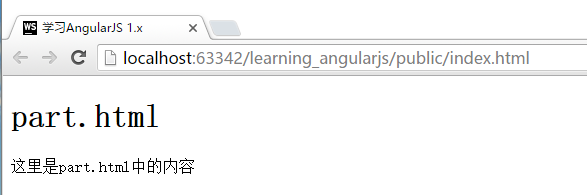
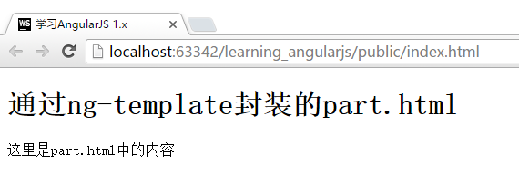

# 使用`templateUrl`获取模板
有些时候，Directive中的模板`template`会变得很大，如果仍然放置在定义中，那么可能会造成阅读和修改不方便的情况。

针对这种情况，我们可以将`template`替换为`templateUrl`，通过引入外部文件的形式来调用布局。

例如：

```javascript
var App = angular.module("App", []);

App.directive("formDirective", function () {
    return {
        restrict: "A",
        scope: {
        },
        templateUrl:"part.html"
    }
});

App.controller("FirstCtrl", function ($scope) {

});
```

```html
<!DOCTYPE html>
<html lang="zh" ng-app="App">
<head>
    <meta charset="UTF-8">
    <title>{{"学习AngularJS 1.x"}}</title>
    <link href="css/style.css" rel="stylesheet">
</head>
<body>

<div ng-controller="FirstCtrl">
    <div form-directive></div>
</div>


<script type="text/javascript" src="components/angular/angular.js"></script>
<script type="text/javascript" src="js/app.js"></script>
</body>
</html>
```

同时，我们还要加入一个新的html文档。为了演示，我们将新建的文档放置在和index.html同一个目录，命名为part.html:

```html
<h1>part.html</h1>
<p>这里是part.html中的内容</p>
```

运行效果：



## `ng-template`
除了直接将HTML部件存储为独立的文件，我们也可以直接使用AngularJS提供的ng-template功能。这点在第四章中也有提到，这里是一个新的示例，帮助您对比物理文件和`ng-template`文件的优先级。

例如：

```html
<!DOCTYPE html>
<html lang="zh" ng-app="App">
<head>
    <meta charset="UTF-8">
    <title>{{"学习AngularJS 1.x"}}</title>
    <link href="css/style.css" rel="stylesheet">
</head>
<body>

<!-- 代码片段开始 -->
<script type="text/ng-template" id="part.html">
    <h1>通过ng-template封装的part.html</h1>
    <p>这里是part.html中的内容</p>
</script>
<!-- 代码片段结束 -->

<div ng-controller="FirstCtrl">
    <div form-directive></div>
</div>

<script type="text/javascript" src="components/angular/angular.js"></script>
<script type="text/javascript" src="js/app.js"></script>
</body>
</html>
```

这里，我们保留了上个例子中的**所有**文件（包括独立的part.html)，对JavaScript也未进行任何修改。

运行效果如下：



要使用这个功能，我们需要在`<script>`标签中，首先声明`type="text/ng-template"`，并给这段代码进行命名，示例代码中的`id="part.html"`即是这部分HTML代码片段的命名。使用时，直接使用`part.html`即可。

这样进行封装，与函数封装调用的概念类似。当默认HTML进行展示时，是不会显示这段代码的。而通过`id`调用后，又可以直接展示出来。

> 注意：通过示例我们可以看到，文档中的`part.html`的优先级高于独立的HTML文件。

## 使用函数获取templateUrl
templateUrl的特性与我们在第四章学习的ng-include类似，也支持通过函数来获取最终的url地址。例如：

```javascript
App.directive("formDirective", function () {
    return {
        restrict: "A",
        scope: {},
        templateUrl: function () {
            return "part.html";
        }
    }
});
```

运行效果与上面的图片一致，就不重复展示了。
