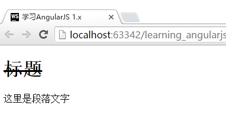
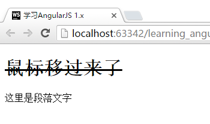

# 让Directive动起来`link()`
在前面几节中，我们都是在学习如何配置Directive。下面，我们将开始学习Directive最灵活的部分，`link()`函数。

`link()`函数的基本使用方法如下：

```javascript
App.directive("formDirective", function () {
    return {
        restrict: "A",
        scope:{
            a:"=",
            b:"=",
            c:"="
        },
        link: function(scope, element, attrs){
            console.log(scope);
            console.log(JSON.stringify(element));
            console.log(JSON.stringify(attrs));
        }
    }
});
```

`link()`带有三个参数，`scope`,`element`,`attrs`。为了更好的了解link函数三个参数的意义，函数中加上了日志输出的`console.log`的命令。

> `scope`未加上`JSON.stringify`转变为json格式输出，是因为`scope`本身涉及循环引用，因此无法转化为json。

对应的HTML代码：

```html
<div form-directive a="1" b="2" c="3"></div>
```

在Chrome的"开发者工具"的控制台中，我们可以看到如下结果：

```javascript
Scope
{$id: 3, $$childTail: null, $$childHead: null, $$prevSibling: null, $$nextSibling: null…}
```

```json
//element
{"0":{"ng339":7},"length":1}

//attrs
{
  "$attr":{
        "formDirective":"form-directive",
        "a":"a",
        "b":"b",
        "c":"c"
      },
  "$$element":[{"ng339":7},1],
  "formDirective":"",
  "a":"1",
  "b":"2",
  "c":"3"
}
```

在这里，我们最主要的是观察最下方的`attrs`部分。我们可以看到，在这个Directive元素中传入的数据，都可以通过`attrs`获取到，这也是我们在`link()`中获取数据的主要方法。

## `element`
从`element`被转义成json的文本中很难获取任何实质的信息，但是，这里才是整个Directive中的**核心部分**。

### `element`与jQuery的关系
在Directive中，我们不免需要对页面元素进行操作。为了提供这项功能，AngularJS几乎原版搬运了jQuery操作元素的功能，他们称之为"jQuery Lite"(jqLite)。

AngularJS通过jqLite的调用方法`angular.element`，实现了jQuery中的大部分常用功能。也就是，我们可以在获取了`element`参数后，调用jQuery常用的语法，如`bind()`,`addClass()`,`removeClass()`等来直接对元素进行操作，实现我们期望的功能。

同时，如果你希望在AngularJS中直接使用完整的jQuery也是非常容易的。只需要安装jQuery，并在`index.html`中，保证在`angular.js`引入之前引入`jQuery.js`。AngularJS会自动将`angular.element`绑定到jQuery上。也就是，在Directive中,会自动使用jQuery来解析界面元素，我们获取的`element`会自动变为jQuery对象。

### 在AngularJS中使用jQuery
安装和使用jQuery共有两步：
- 通过`bower`安装jQuery

```bash
bower install jquery --save
```

- 在`index.html`中引入`jquery.js`

```html
<!-- 保证在angular.js之前引入jquery.js -->
<script type="text/javascript" src="components/jquery/dist/jquery.js"></script>
<script type="text/javascript" src="components/angular/angular.js"></script>
```

### 实际体验`element`的功能
我们在引入jQuery后，可以通过如下代码查看效果：

> 这里需要注意的是，使用jqLite的方法和以下代码中使用的方法是不一样的，因为jqLite不支持通过标签方式获取子元素。如果您有兴趣学习jqLite的使用方法（并且拥有一定的英文阅读能力），可以在[这里](https://docs.angularjs.org/api/ng/function/angular.element)查看官方文档。

```javascript
App.directive("formDirective", function () {
    return {
        restrict: "A",
        template:"<h1>标题</h1><p>这里是段落文字</p>",
        link: function(scope, element, attrs){
            element.children("h1").addClass("strike");
        }
    }
});
```

```html
<div ng-controller="FirstCtrl">
    <div form-directive></div>
</div>
```



### 在`element`上绑定鼠标移入移出时的变化效果

```javascript
App.directive("formDirective", function () {
    return {
        restrict: "A",
        template:"<h1>标题</h1><p>这里是段落文字</p>",
        link: function(scope, element, attrs){
            element.children("h1").bind("mouseenter", function(){
                element.children("h1").addClass("strike");
                element.children("h1").text("鼠标移过来了");
            });

            element.children("h1").bind("mouseleave", function(){
                element.children("h1").removeClass("strike");
                element.children("h1").text("鼠标移开了");
            })
        }
    }
});
```

运行时，当鼠标移动到标题上，则标题文字会变化成"鼠标移过来了"，并加上删除线效果；当鼠标移开，则文字会变为"鼠标移开了"。



因为主要是jQuery的用法，更多的实际应用就不在本书中详述了。如果有兴趣学习jQuery，您可以通过上网搜索或者购买书籍的方式来学习。
