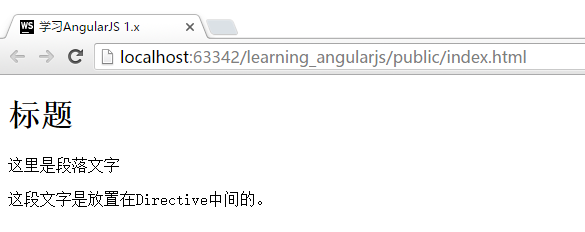
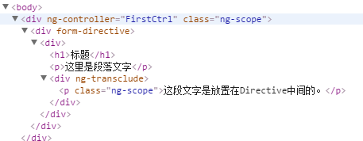

# 把Directive变为一个容器`transclude`
在前面我们使用到的Directive，都会将包含有Directive的元素整体替换为`template`中的内容。这样，就让Directive的用途缩减为只能封装最低级别的元素。

但是我们使用的`ng-app`,`ng-controller`等，也同样都是Directive，而我们可以在这些元素中，直接填入HTML代码。这是如何实现的呢？这就要应用到Directive的`transclude`属性。

```javascript
App.directive("formDirective", function () {
    return {
        restrict: "A",        
        //通过transclude标签将Directive变为一个容器
        transclude: true,
        //注意template中的ng-transclude，这里是放置原有代码的地方。
        template: "<h1>标题</h1><p>这里是段落文字</p><div ng-transclude></div>"
    }
});
```

```html
<div ng-controller="FirstCtrl">
    <div form-directive>
        <p>这段文字是放置在Directive中间的。</p>
    </div>
</div>
```

运行结果：



查看HTML代码如下：


