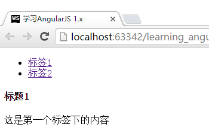

# Directive之间互相通讯
本节是Directive的高级使用方法之一，通过赋予Directive之间互相通讯的功能，我们可以将部件的抽象化提升到一个更高的层次。

本节将通过官方网站中一个较复杂的[例子](https://docs.angularjs.org/guide/directive)来讲解具体的使用方法，通过Directive的配置，将HTML中的代码自动抽取为一个Tab列表，点击Tab列表中的标题，则可自动的显示Tab中包含的内容。

在JavaScript代码中，我们声明了2个Directive，`gqTabContainer`和`gqTabContent`。

`gqTabContainer`中加入了`controller`这项配置，并封装了`panes`用于存储数据，`$scope.select`用于接收界面点击事件，以及一个`addPane`方法用于接收`gqTabContent`的调用。

`gqTabContent`中加入了`require`这项配置，获取的对象作为第四个参数传入`link()`函数。

```javascript
var App = angular.module("App", []);

App.directive("gqTabContainer", function () {
    return {
        restrict: 'E',
        transclude: true,
        scope: {},
        //注意这里为tabContainer增加了一个controller，并引入了$scope
        controller: ['$scope', function ($scope) {
            var panes = $scope.panes = [];

            //tab列表中项目被选中（点击）的处理函数
            $scope.select = function (pane) {
                angular.forEach(panes, function (pane) {
                    pane.selected = false;
                });
                pane.selected = true;
            };

            //初始化页面时，供其他Directive调用的注册函数
            this.addPane = function (pane) {
                if (panes.length === 0) {
                    $scope.select(pane);
                }
                panes.push(pane);
            };
        }],
        //注意templateUrl的命名
        templateUrl: "gqTabList"
    };
});

App.directive('gqTabContent', function () {
    return {
        //获取gqTabContainer这个Directive
        require: '^gqTabContainer',
        restrict: 'E',
        transclude: true,
        scope: {
            title: '@'
        },
        //第四个参数是获取到的Directive
        link: function (scope, element, attrs, tabContainer) {
            //调用了上方gqTabContainer的addPane()方法
            //注意参数命名，不需要和上方Directive一致
            tabContainer.addPane(scope);
        },
        //注意templateUrl的命名
        templateUrl: "gqTabContent"
    };
});
```

在HTML代码中，我们直接使用了`gq-tab-container`和`gq-tab-content`。

```html
<!DOCTYPE html>
<html lang="zh" ng-app="App">
<head>
    <meta charset="UTF-8">
    <title>{{"学习AngularJS 1.x"}}</title>
    <link href="css/style.css" rel="stylesheet">
</head>
<body>

<script type="text/javascript" src="components/jquery/dist/jquery.js"></script>
<script type="text/javascript" src="components/angular/angular.js"></script>
<script type="text/javascript" src="js/app.js"></script>

<gq-tab-container>
    <gq-tab-content title="标签1">
        <h4>标题1</h4>
        <p>这是第一个标签下的内容</p>
    </gq-tab-content>
    <gq-tab-content title="标签2">
        <h4>标题2</h4>
        <p>这是第二个标签下的内容</p>
    </gq-tab-content>
</gq-tab-container>

<!--这里为了将文件整理在一起，使用了ng-template的方式-->
<script type="text/ng-template" id="gqTabList">

    <ul>
        <li ng-repeat="pane in panes" ng-class="{active:pane.selected}">
            <a href="" ng-click="select(pane)">{{pane.title}}</a>
        </li>
    </ul>
    <div ng-transclude></div>

</script>

<script type="text/ng-template" id="gqTabContent">

    <div ng-show="selected" ng-transclude>
    </div>

</script>

</body>
</html>
```

运行效果：
- 当点击"标签1"或"标签2"时，下方会自动展示对应的内容。

  
